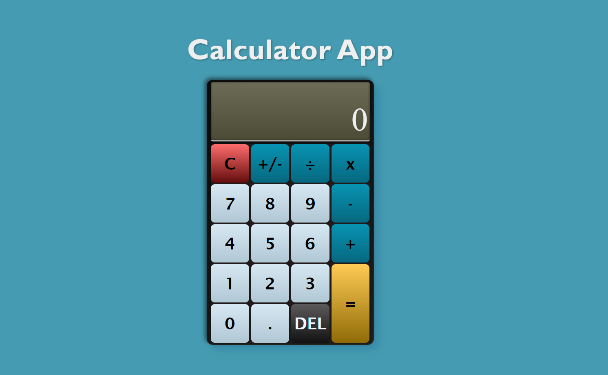

# Calculator

Live Demo:
https://leo-tsant.github.io/Calculator/

## Overview

This project was created for the [Calculator assignment](https://www.theodinproject.com/lessons/foundations-calculator) as part of [The Odin Project](https://www.theodinproject.com/). A simple calculator application built using HTML, CSS, and JavaScript. It can perform basic arithmetic operations such as addition, subtraction, multiplication, and division.
